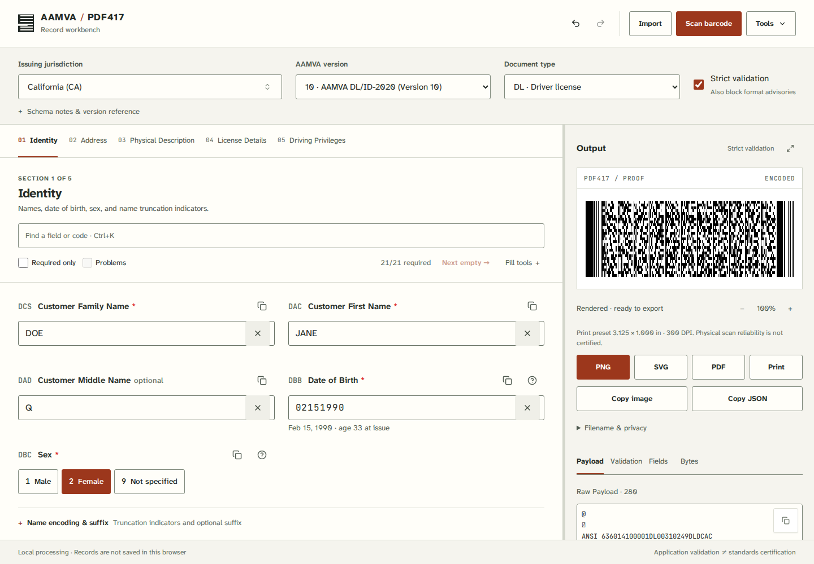

# AAMVA / PDF417

A local record workbench for creating, importing, inspecting, and exporting AAMVA payloads and PDF417 barcodes. React + TypeScript in a browser, an installable PWA, or an optional Electron desktop window.

[Open the published app](https://seanpvera.github.io/aamva-pdf417-generator/) · [Audit and validation evidence](docs/AUDIT_2026-09-24.md) · [Design system](docs/design/WORKBENCH.md)



The published app follows `main`; a draft pull request does not update it.

## Scope

The field registry contains versions **01–11** and **55 US jurisdictions**. Registry coverage is not standards certification. Only Connecticut and New York currently have repository fixtures whose layouts originate outside this encoder. Issuer defaults, many field rules, and print presets still need authoritative verification.

Use synthetic or otherwise authorized data. This tool does not verify a person's identity or create an authentic government credential.

## Run locally

Requires Node **20.19+** and npm; CI uses Node 20 and 22.

```bash
git clone https://github.com/SeanPVera/aamva-pdf417-generator.git
cd aamva-pdf417-generator
npm ci
npm run dev
```

Open the localhost URL Vite prints. For a browser-only install where the Electron binary cannot be downloaded, use `ELECTRON_SKIP_BINARY_DOWNLOAD=1 npm ci` (PowerShell: set `$env:ELECTRON_SKIP_BINARY_DOWNLOAD="1"` first). Do not disable TLS verification.

```bash
npm run build
npm run serve
```

For a desktop development window: `npm run electron:dev`. For a production desktop window, build first, then `npm start`.

## Work with a record

1. Set the **issuing jurisdiction**, **AAMVA version**, and **DL/ID document type**. Strict validation also blocks the application's format advisories; it does not certify standards compliance.
2. Edit the numbered sections. Search spans every section; **Required only**, **Problems**, and **Next empty** help navigate dense records. Name truncation flags and suggestions expand in place.
3. Use **Fill tools** for explicitly synthetic data or generate individual identifiers. The live preview never invents values absent from the form. Address jurisdiction (`DAJ`) is independent of the issuing jurisdiction.
4. Inspect **Payload**, **Validation**, **Fields**, and **Bytes** beside the barcode. On a phone, use **Setup**, **Form**, and **Barcode** in the bottom navigation. An imported raw payload remains available separately from generated output.
5. Export **PNG**, **SVG**, or **PDF**, or print. Export is enabled only for the current successfully rendered payload. **Tools → Export record JSON** preserves the editable record, including unknown element codes.

**Import** accepts pasted AAMVA bytes or JSON, and JSON/text files. JSON files can also be dropped onto the page. **Scan barcode** uses a camera or an uploaded image. Import replaces the document in one undoable step, including jurisdiction, version, document type, and original source. Invalid imports preserve the current work. Unsupported issuer IINs are refused instead of being assigned to the current issuer.

Unknown three-character element codes are retained for inspection and JSON export. They are visibly excluded from regeneration when the selected schema does not model them. This is not a lossless arbitrary-payload editor.

**Tools** also contains comparison, batch CSV/JSON processing, keyboard help, light/dark/system appearance, and **Erase record & history**. Erasure clears the active record and application undo history; it cannot undo downloads, printing, or clipboard copies.

## Input and output contracts

JSON is a flat object of **string values**. Metadata keys are `state`, `version`, and `subfileType`. Numeric identifiers are rejected because their leading zeros may already have been lost.

```json
{
  "state": "CA",
  "version": "10",
  "subfileType": "ID",
  "DCS": "EXAMPLE",
  "DAC": "JANE",
  "DAJ": "NV"
}
```

This example is intentionally incomplete. The form identifies the remaining required fields.

- Version 01 uses `YYYYMMDD`; later modeled versions use `MMDDYYYY` for the main dates. Separated dates normalize visibly on blur.
- Generation currently accepts **printable ASCII**. Unsupported characters are rejected without transliteration or deletion. The published standard permits a broader single-byte repertoire; this implementation does not yet encode all of it.
- Quick fixes use explicit spelling aliases or unambiguous formatting. They do not truncate identity values, guess from prefixes, or alter opaque jurisdiction data.
- Single-record input is bounded at 1 MB; raw wire parsing at 100,000 single-byte characters. Batch input is bounded at 5 MB / 1,000 rows, and scanner images at 20 MB. These are application resource limits, not PDF417 capacity claims.
- PDF417 capacity is checked by the encoder. Preview, SVG, PNG, PDF, and print are different rendering paths; physical scanner and printer validation is still required. State-labeled print dimensions are **unverified application presets**.
- Batch PDF currently uses its existing page-fit layout, rather than the single-record print presets. Missing discriminator/revision fields may be synthesized by the batch generation option; inspect batch data before treating it as an exact record export.

## Privacy and offline behavior

There is no backend or analytics. Record processing is local. The production CSP blocks network connections from the app. Fonts and code are self-hosted and precached for offline use after a successful online load.

Only UI preferences are persisted in localStorage. Field values, imported source, and undo/redo records remain in memory. Downloads and clipboard copies are explicit exports of potentially sensitive data. Default filenames include no names or document identifiers; name inclusion is opt-in. Read-aloud is available only with a voice the browser reports as local.

## Platforms

- Static website / GitHub Pages: `.github/workflows/pages.yml` publishes `main`.
- Installable PWA: see [iPhone setup and offline verification](docs/IPHONE.md). Camera access normally requires HTTPS or localhost.
- Electron: Windows NSIS, macOS DMG (x64 / arm64), Linux AppImage / deb. Navigation is restricted, renderer sandboxing and context isolation are enabled, and Node integration is disabled.
- [Release downloads](https://github.com/SeanPVera/aamva-pdf417-generator/releases). Desktop packages are not code-signed. Native packaging and real devices require their own validation.

Build installers with `npm run dist:win`, `npm run dist:mac`, or `npm run dist:linux` on the appropriate platform. These commands do not publish releases.

## Development and validation

```bash
npm run lint
npm run format:check
npm run typecheck
npm run test:run
npm run test:coverage
npm run build
npm run size
npm run conformance:report
npm audit --audit-level=high
npm run test:e2e:install
npm run test:e2e
```

`PW_BROWSERS=all npm run test:e2e` selects the full configured browser matrix after installing those engines. `PW_CHROMIUM_EXECUTABLE=/path/to/chromium` optionally selects a local Chromium binary. CI's ordinary browser setup is unchanged.

The unit suite includes deterministic fixtures, malformed-input tests, property tests, and an independent ZXing pixel decoder. Browser tests exercise the actual downloaded PNG as well as state, keyboard, import, export, responsive layout, and WCAG checks. Neither green tests nor an internally balanced byte directory prove issuer compliance.

| Area                                  | Location                                                                       |
| ------------------------------------- | ------------------------------------------------------------------------------ |
| Framing, encoding, parsing            | `src/core/generator.ts`, `decoder.ts`, `inspect.ts`                            |
| Versions and fields                   | `src/core/schema.ts`                                                           |
| Issuer registry and observed profiles | `src/core/states.ts`, `jurisdictionRules.ts`                                   |
| Validation and explicit repairs       | `src/core/validation.ts`, `quickFix.ts`                                        |
| Import and batch boundaries           | `src/core/importPayload.ts`, `pasteImport.ts`, `batchInput.ts`, `csv.ts`       |
| Document history and preferences      | `src/hooks/useFormStore.ts`                                                    |
| Live payload lifecycle                | `src/hooks/usePayload.ts`                                                      |
| Workspace and design tokens           | `src/App.tsx`, `src/components/`, `src/styles/index.css`, `tailwind.config.js` |
| Electron boundary                     | `main.js`, `preload.js`, `electron/urlPolicy.js`                               |
| Tests and provenance                  | `src/tests/`, `e2e/`, `src/core/conformance/`                                  |

See [CONTRIBUTING.md](CONTRIBUTING.md), [CLAUDE.md](CLAUDE.md), and the [implementation coverage matrix](docs/AAMVA_COMPLIANCE_MATRIX.md). Add a changeset for reviewable release notes. Do not regenerate golden fixtures simply to make a failing test pass.

MIT license — [LICENSE](LICENSE).
